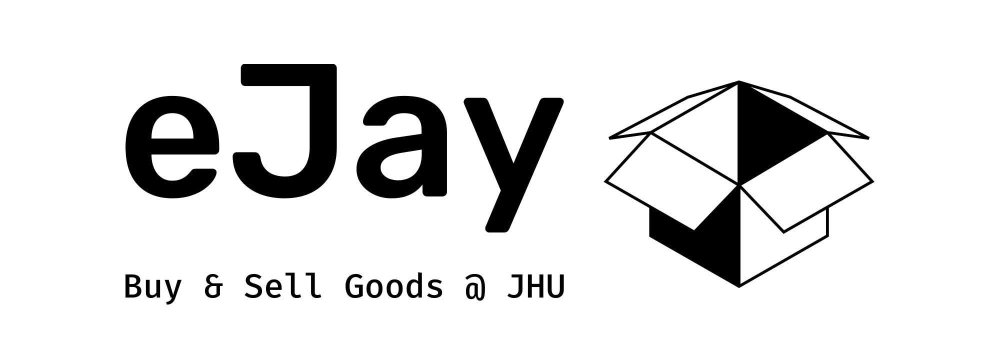

[![Issues][issues-shield]][issues-url]
[![MIT License][license-shield]][license-url]

<br />

<div align="center">
  <a href="https://github.com/jhu-oose-f22/team-return0">
    
  </a>
  <!-- <h3 align="center">eJay Platform</h3> -->
  <p align="center">
    <!-- Buy & Sell Goods @ JHU -->
    <br />
    <a href="https://github.com/jhu-oose-f22/team-return0/blob/main/README.md"><strong>Explore the docs »</strong></a>
    <br />
    <br />
    <a href="https://github.com/orgs/jhu-oose-f22/projects/3/views/1?layout=table">Project Board</a>
    ·
    <a href="https://github.com/jhu-oose-f22/team-return0/tree/dev">Latest Code</a>
    ·
    <a href="https://github.com/jhu-oose-f22/team-return0/tree/main">Current Release</a>
    ·
    <a href="https://github.com/jhu-oose-f22/team-return0/issues">Request Feature</a>
  </p>
</div>


<details>
  <summary>Table of Contents</summary>
  <ol>
    <li>
      <a href="#about-the-project">About The Project</a>
      <ul>
        <li><a href="#built-with">Built With</a></li>
      </ul>
    </li>
    <li>
      <a href="#getting-started">Getting Started</a>
      <ul>
        <li><a href="#dependencies">Dependencies</a></li>
        <li><a href="#installation">Installation</a></li>
      </ul>
    </li>
    <!-- <li><a href="#usage">Usage</a></li> -->
    <li><a href="#roadmap">Roadmap</a></li>
    <!-- <li><a href="#contributing">Contributing</a></li> -->
    <li><a href="#contact">Contact</a></li>
    <li><a href="#license">License</a></li>
    <!-- <li><a href="#acknowledgments">Acknowledgments</a></li> -->
  </ol>
</details>


## About The Project

eJay is a **JHU community-exclusive used goods trading platform**.

Each year, new students move in and graduates move out of the Baltimore area. There is much potential for used goods trading even within the JHU community. But existing platforms cannot perfectly solve this pain point because

  - Platforms like eBay are inefficient and expensive. As sellers and buyers of our platform are all present in the same area, we connect these users to facilitate meet & trade locally. For example,
    - Users may conveniently obtain goods like kitchen appliances that will be used on Day 1 moving in.
    - Hard-to-move goods like furniture may no longer need high delivery costs for shipping across the country. But the freshman buyer may find a JHU graduate who is living upstairs selling this item.
  - Users on existing platforms may not be trustworthy in terms of good quality.

We also find students resolve to online group chats on WhatsApp and WeChat groups for posting this information/advertisements. However, the information is scattered and incomplete. For example, the seller posts an image of a pot he wants to sell to a group chat. It may not contain information about where the seller lives. The message is also among many unrelated messages, making this information hard to find and update.

Our platform wants to address these inefficiencies and enhance the information sharing about used item selling among the JHU community.

eJay provides
* Focus on the JH community, which enables instant online and offline deals;
* Seller and buyer two-way rate as integrity guarantee;
* A recommendation system help finds stuff in need quickly;
* The address of the product would be visualized via a map;
* Sell and buyer may opt for delivery;
* Buyers may filter products with distance constraints;


We are in active development! Feel free to report bugs to us by opening an [issue](https://github.com/jhu-oose-f22/team-return0/issues). The project backlog is also available [here](https://github.com/orgs/jhu-oose-f22/projects/3/views/1?layout=table) for progress management.

<p align="right">(<a href="#readme-top">back to top</a>)</p>


### Built With

<!-- * [![Next][Next.js]][Next-url]

* [![React][React.js]][React-url]
* [![Bootstrap][Bootstrap.com]][Bootstrap-url]
* [![JQuery][JQuery.com]][JQuery-url] -->

We are following the MERN stack!

* [MongoDB](https://www.mongodb.com/)
* [Express](https://expressjs.com/)
* [React JS](https://reactjs.org/)
* [Node.JS](https://nodejs.org/en/)

<p align="right">(<a href="#readme-top">back to top</a>)</p>


<!-- GETTING STARTED -->
## Getting Started

### Dependencies

The current dependencies of the project are listed as follows. Please follow the instructions on their official website to install them.

* [npm](https://www.npmjs.com/)
  ```sh
  npm install npm@latest -g
  ```
* [node.js](https://nodejs.org/en/)
* [React.js](https://reactjs.org/)
* [Python & PIP](https://www.python.org/)

Follow the installation guide to install these dependencies.

### Installation and Run

#### Start both the backend & front locally

1. Go to src folder: ```cd src```;
2. Make image cache directory: `mkdir uploads-images-cache`
3. Run: ```npm install``` to install dependencies;
4. Run: ```pip install openai``` to install Python dependencies
5. Run: ```npm run dev``` to start.

#### Run backend only

1. Go to src folder: ```cd src``` 
2. Run: ```pip install openai``` to install Python dependencies
3. Run: ```npm run server``` to start the backend server.

#### Run front-end only

1. Go to src folder: ```cd src``` and run ```npm run client``` to start the frontend client;

#### Running

Place the configuration `default.json` file in `./src/config/` folder **(NEW!)**
We provide a dummy account for testing existing features.

- Account name: `kan9@jh.edu`
- Password: `letmein`

- Account name: `huhu@jhu.edu`
- Password: `huhuhu`

#### Web Demo (NEW!)

- [Click to start](http://ejay.online)

<p align="right">(<a href="#readme-top">back to top</a>)</p>

<!-- USAGE EXAMPLES -->
<!-- ## Usage

Use this space to show useful examples of how a project can be used. Additional screenshots, code examples and demos work well in this space. You may also link to more resources.

_For more examples, please refer to the [Documentation](https://example.com)_

<p align="right">(<a href="#readme-top">back to top</a>)</p>
 -->


<!-- ROADMAP -->
## Roadmap

- [x] Items listed in tags/category for easy finding and indexing
- [X] Seller can list their product and upload images and descriptions.
- [X] Product search and filtering feature
- [X] Rich user profile: more information on contact
- [x] Shopping list and transaction contact
- [x] Rich information about residence and location
- [x] Rating features
- [x] Email notification and verification
- [x] Personalized recommendations based on previous transactions, viewing history, or location
    - [x] Recommendation algorithm
    - [x] Recommendation pipeline

See the [open issues](https://github.com/jhu-oose-f22/team-return0/issues) for pending issues.

<p align="right">(<a href="#readme-top">back to top</a>)</p>


<!-- CONTRIBUTING -->
<!-- ## Contributing

Contributions are what make the open source community such an amazing place to learn, inspire, and create. Any contributions you make are **greatly appreciated**.

If you have a suggestion that would make this better, please fork the repo and create a pull request. You can also simply open an issue with the tag "enhancement".
Don't forget to give the project a star! Thanks again!

1. Fork the Project
2. Create your Feature Branch (`git checkout -b feature/AmazingFeature`)
3. Commit your Changes (`git commit -m 'Add some AmazingFeature'`)
4. Push to the Branch (`git push origin feature/AmazingFeature`)
5. Open a Pull Request

<p align="right">(<a href="#readme-top">back to top</a>)</p> -->


<!-- CONTACT -->
## Contact

Slack communication is preferred.

Project Link: [https://github.com/jhu-oose-f22/team-return0](https://github.com/jhu-oose-f22/team-return0)

<p align="right">(<a href="#readme-top">back to top</a>)</p>

## License
MIT

<!-- ACKNOWLEDGMENTS -->
<!-- ## Acknowledgments

Use this space to list resources you find helpful and would like to give credit to. I've included a few of my favorites to kick things off!

* [Choose an Open Source License](https://choosealicense.com)
* [GitHub Emoji Cheat Sheet](https://www.webpagefx.com/tools/emoji-cheat-sheet)
* [Malven's Flexbox Cheatsheet](https://flexbox.malven.co/)
* [Malven's Grid Cheatsheet](https://grid.malven.co/)
* [Img Shields](https://shields.io)
* [GitHub Pages](https://pages.github.com)
* [Font Awesome](https://fontawesome.com)
* [React Icons](https://react-icons.github.io/react-icons/search) -->

<p align="right">(<a href="#readme-top">back to top</a>)</p>


<!-- MARKDOWN LINKS & IMAGES -->
<!-- https://www.markdownguide.org/basic-syntax/#reference-style-links -->
[contributors-shield]: https://img.shields.io/github/contributors/othneildrew/Best-README-Template.svg?style=for-the-badge
[contributors-url]: https://github.com/othneildrew/Best-README-Template/graphs/contributors
[forks-shield]: https://img.shields.io/github/forks/othneildrew/Best-README-Template.svg?style=for-the-badge
[forks-url]: https://github.com/othneildrew/Best-README-Template/network/members
[stars-shield]: https://img.shields.io/github/stars/othneildrew/Best-README-Template.svg?style=for-the-badge
[stars-url]: https://github.com/othneildrew/Best-README-Template/stargazers
[issues-shield]: https://img.shields.io/github/issues/othneildrew/Best-README-Template.svg?style=for-the-badge
[issues-url]: https://github.com/othneildrew/Best-README-Template/issues
[license-shield]: https://img.shields.io/github/license/othneildrew/Best-README-Template.svg?style=for-the-badge
[license-url]: https://github.com/jhu-oose-f22/team-return0/blob/main/LICENSE.txt
[linkedin-shield]: https://img.shields.io/badge/-LinkedIn-black.svg?style=for-the-badge&logo=linkedin&colorB=555
[linkedin-url]: https://linkedin.com/in/othneildrew
[product-screenshot]: images/screenshot.png
[Next.js]: https://img.shields.io/badge/next.js-000000?style=for-the-badge&logo=nextdotjs&logoColor=white
[Next-url]: https://nextjs.org/
[React.js]: https://img.shields.io/badge/React-20232A?style=for-the-badge&logo=react&logoColor=61DAFB
[React-url]: https://reactjs.org/
[Vue.js]: https://img.shields.io/badge/Vue.js-35495E?style=for-the-badge&logo=vuedotjs&logoColor=4FC08D
[Vue-url]: https://vuejs.org/
[Angular.io]: https://img.shields.io/badge/Angular-DD0031?style=for-the-badge&logo=angular&logoColor=white
[Angular-url]: https://angular.io/
[Svelte.dev]: https://img.shields.io/badge/Svelte-4A4A55?style=for-the-badge&logo=svelte&logoColor=FF3E00
[Svelte-url]: https://svelte.dev/
[Laravel.com]: https://img.shields.io/badge/Laravel-FF2D20?style=for-the-badge&logo=laravel&logoColor=white
[Laravel-url]: https://laravel.com
[Bootstrap.com]: https://img.shields.io/badge/Bootstrap-563D7C?style=for-the-badge&logo=bootstrap&logoColor=white
[Bootstrap-url]: https://getbootstrap.com
[JQuery.com]: https://img.shields.io/badge/jQuery-0769AD?style=for-the-badge&logo=jquery&logoColor=white
[JQuery-url]: https://jquery.com
